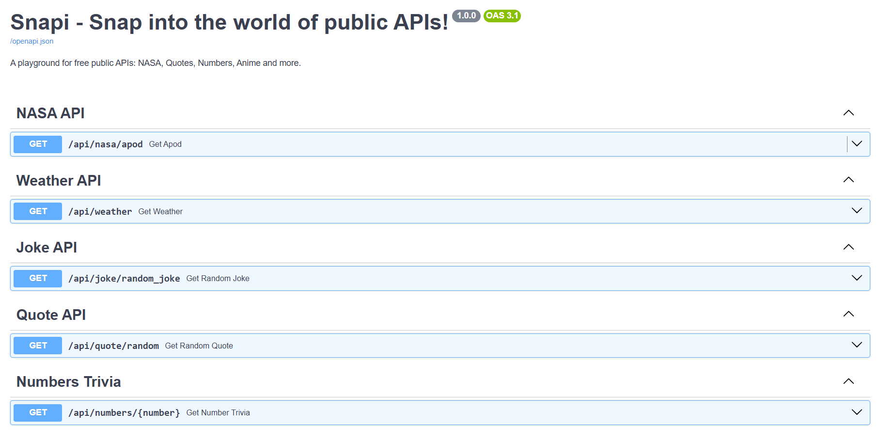

# Snapi - FastAPI Microservice

Snapi is a lightweight and modern FastAPI-based backend service built for experimenting with public APIs, rapid endpoint development, and clean, automatic API documentation using Swagger (OpenAPI).

## 🧑‍💻 Swagger API Docs
[Snapi](https://snapi-swagger.onrender.com/docs)

## Snapshot📸

## Contributions 🤝
All contributions are welcome! If you spot any issues, have suggestions, or want to add public api endpoints, feel free to create a PR. Thanks for contributing to this project! 🚀

## Connect🌐

### Leave a 🌟 if you like it!

### Thank You!
